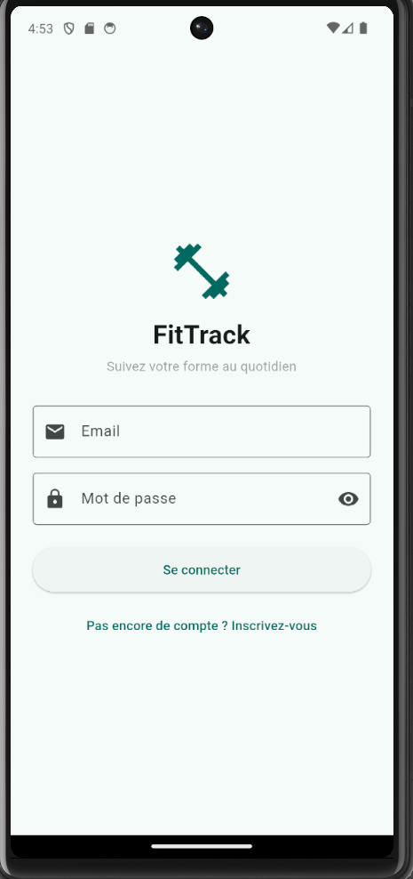
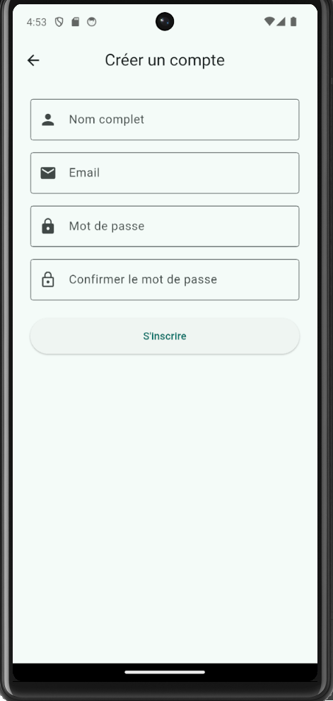
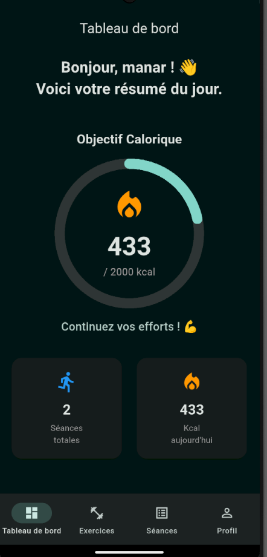
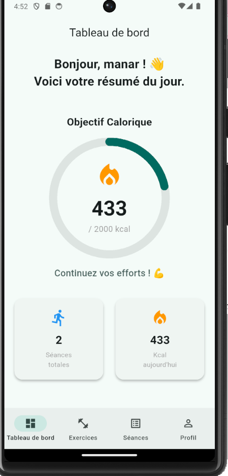
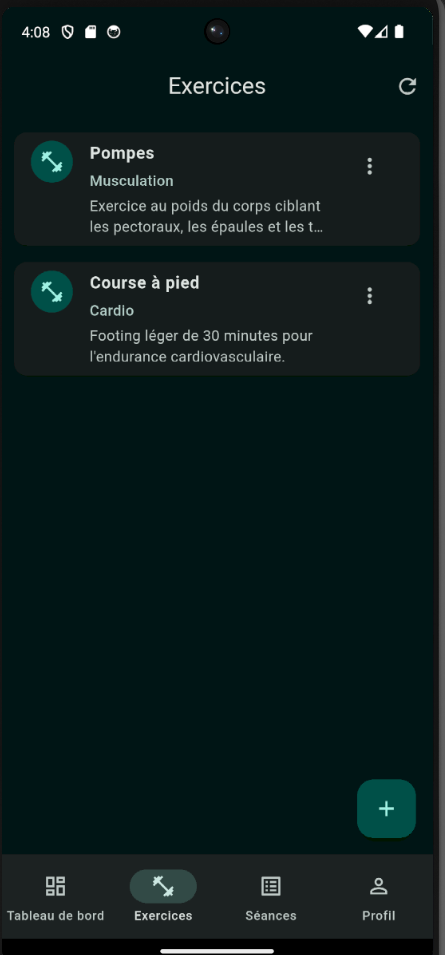
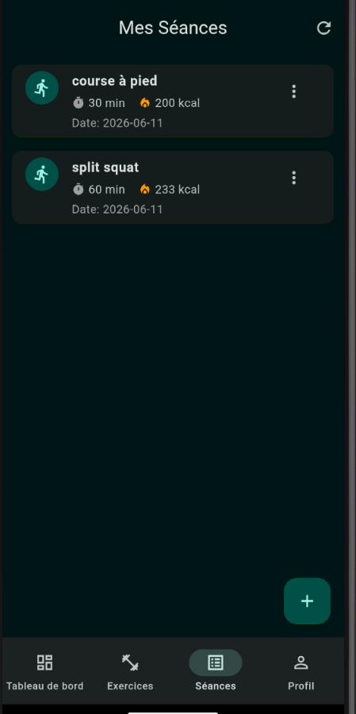
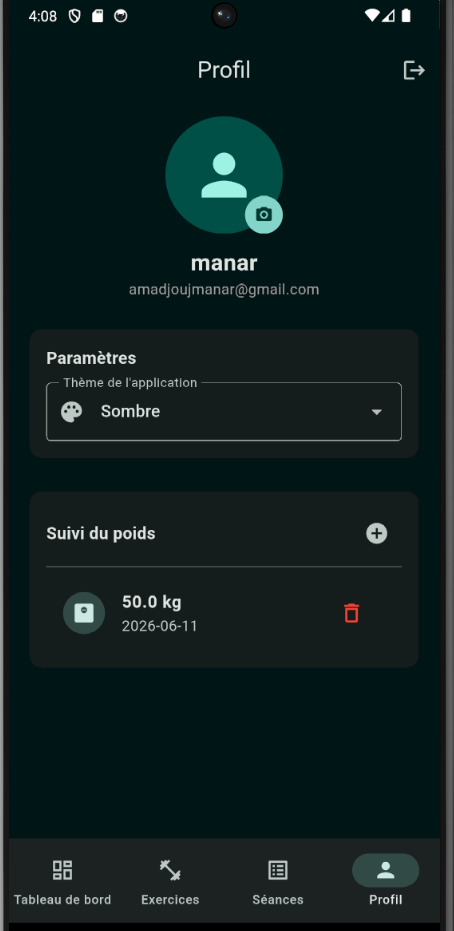
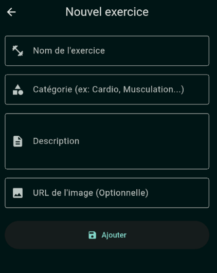
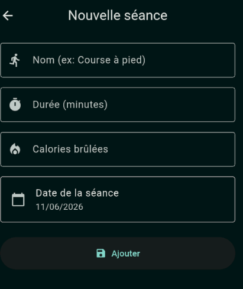
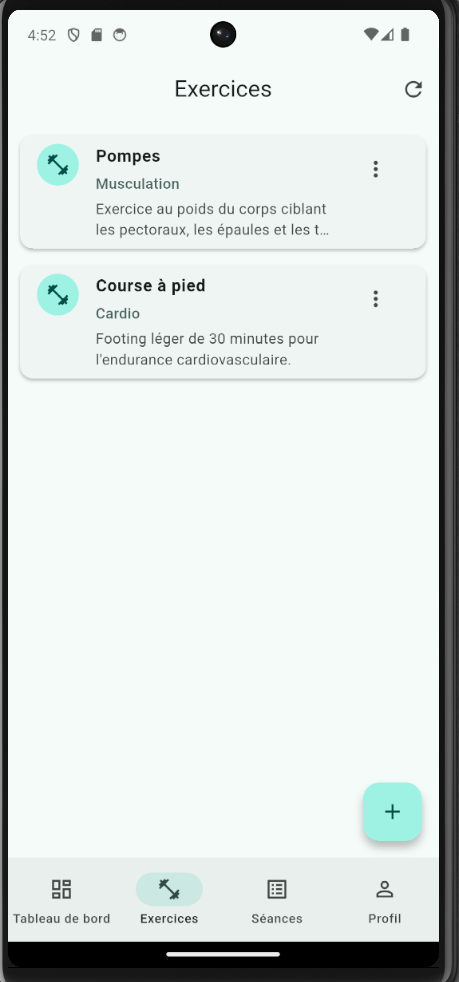

# FitTrack  - Application Mobile de Suivi Fitness

##  Présentation du Projet

FitTrack est une application mobile développée avec Flutter permettant aux utilisateurs de gérer et suivre leurs activités sportives. L'application offre une interface moderne, intuitive et responsive pour la gestion des exercices, le suivi des performances et la consultation de statistiques personnalisées.

Ce projet a été réalisé dans le cadre du module **Développement Mobile** à l'**École Nationale des Sciences Appliquées de Tanger (ENSA Tanger)**.

---

##  Membre du Groupe

* Manar Amadjouj


---

##  Objectifs du Projet

L'application vise à :

* Faciliter la planification des entraînements sportifs.
* Assurer le suivi des performances physiques.
* Permettre la gestion complète des exercices.
* Fournir des statistiques motivantes à l'utilisateur.
* Découvrir le développement mobile avec Flutter et les API REST.

---

##  Captures d'écran

###  Authentification

<p align="center">
  
  
</p>

---

###  Dashboard

<p align="center">
  
  
</p>

---

###  Gestion des Exercices (CRUD)

Voici quelques écrans de la gestion des exercices :

<p align="center">
  
  
  
  
  
  
</p>

## Fonctionnalités Réalisées

### Fonctionnalités Principales

* Authentification utilisateur (Connexion / Inscription)
* Validation des formulaires
* Navigation entre les écrans
* CRUD complet des exercices
* Interface responsive
* Gestion des erreurs utilisateur

###  Fonctionnalités Avancées

* Consommation d'API REST
* Dashboard statistique
* Géolocalisation
* Notifications locales
* Animations Flutter
* Gestion asynchrone des données

---

##  Technologies Utilisées

| Technologie                 | Utilisation              |
| --------------------------- | ------------------------ |
| Flutter                     | Développement Mobile     |
| Dart                        | Langage de programmation |
| HTTP Package                | Consommation API REST    |
| Geolocator                  | Géolocalisation          |
| Flutter Local Notifications | Notifications            |
| Material Design             | Interface Utilisateur    |

---

## Architecture de l'application (MVC améliorée)

L'application adopte une architecture **MVC (Model - View - Controller/Service)** afin de garantir :

- Séparation claire des responsabilités
- Code maintenable et évolutif
- Réutilisation des composants
- Meilleure organisation du projet

---

### Model (Données)

Contient les structures de données principales.

Exemples :
- `Exercise`
- `Workout`
- `User`

Responsabilité :
- Représentation des données
- Sérialisation / Désérialisation JSON

---

### View (Interface utilisateur)

Contient toutes les interfaces graphiques.

Exemples :
- Login Screen
- Dashboard Screen
- Exercises Screen

Responsabilité :
- Affichage des données
- Interaction utilisateur
- Navigation

---

###  Service / Controller (Logique métier)

Contient la logique de l’application et la communication avec les sources de données.

Exemples :
- `exercise_api_service.dart`
- `auth_service.dart`
- `local_storage_service.dart`

Responsabilité :
- Appels API REST
- Gestion des données locales
- Traitement logique

---

##  Structure du Projet

lib/
│
├── models/                 # Structures des données (Exercise, Workout, User...)
│   └── exercise.dart
│
├── views/                  # Toutes les interfaces de l'application
│   │
│   ├── auth/               # Écrans d'authentification
│   │   ├── login_screen.dart
│   │   └── register_screen.dart
│   │
│   ├── home/               # Écrans principaux après connexion
│   │   ├── dashboard_screen.dart
│   │   └── exercises_screen.dart
│
├── services/               # Logique métier + API + données locales
│   ├── auth_service.dart
│   ├── exercise_api_service.dart
│   ├── local_workout_service.dart
│   └── location_service.dart
│
├── widgets/                # Composants UI réutilisables
│   ├── exercise_card.dart
│   └── stat_card.dart
│
├── theme/                  # Styles globaux de l'application
│   └── app_theme.dart
│
└── main.dart               # Point d'entrée de l'application

---

##  API utilisée

L'application utilise une API locale pour la gestion des exercices.

###  Endpoint principal

http://10.0.2.2:3000/exercices

###  Description

- `10.0.2.2` permet à l’émulateur Android d’accéder au localhost de la machine
- L’API permet :
  - Ajouter un exercice
  - Modifier un exercice
  - Supprimer un exercice
  - Récupérer la liste des exercices

###  Format des données

Les données sont manipulées au format JSON.

## Gestion des données locales

En plus de l’API REST, l’application manipule des données locales pour certains workouts afin de :

- Améliorer la performance
- Permettre un fonctionnement hors connexion (offline)
- Réduire les appels réseau

Les données locales sont utilisées pour stocker temporairement :
- Les séances d’entraînement
- Les exercices récents
- Les états de progression utilisateur


---

##  Installation et Exécution

### 1. Cloner le dépôt

```bash
git clone https://github.com/votre-compte/fittrack.git
```

### 2. Accéder au projet

```bash
cd fittrack
```

### 3. Installer les dépendances

```bash
flutter pub get
```

### 4. Lancer l'application

```bash
flutter run
```

---

##  Prérequis

* Flutter SDK
* Dart SDK
* Android Studio ou VS Code
* Émulateur Android ou appareil physique

---

##  Tests Réalisés

* Validation des formulaires
* Navigation entre écrans
* Tests CRUD
* Vérification des appels API
* Vérification responsive

---

##  Compétences Acquises

* Développement Flutter
* Architecture MVC
* Consommation d'API REST
* Gestion d'état
* Validation des formulaires
* Responsive Design
* Utilisation de Git et GitHub

---

##  Conclusion

FitTrack constitue une application mobile complète permettant de mettre en pratique les concepts fondamentaux du développement Flutter. Le projet démontre l'utilisation d'une architecture MVC, l'intégration d'API REST et le développement d'une interface utilisateur moderne et responsive.

Projet réalisé dans le cadre du module Développement Mobile – ENSA Tanger.
